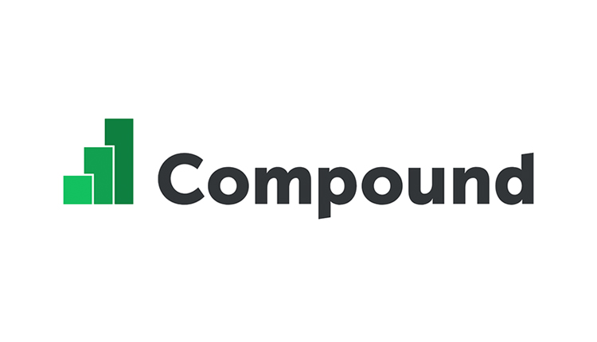
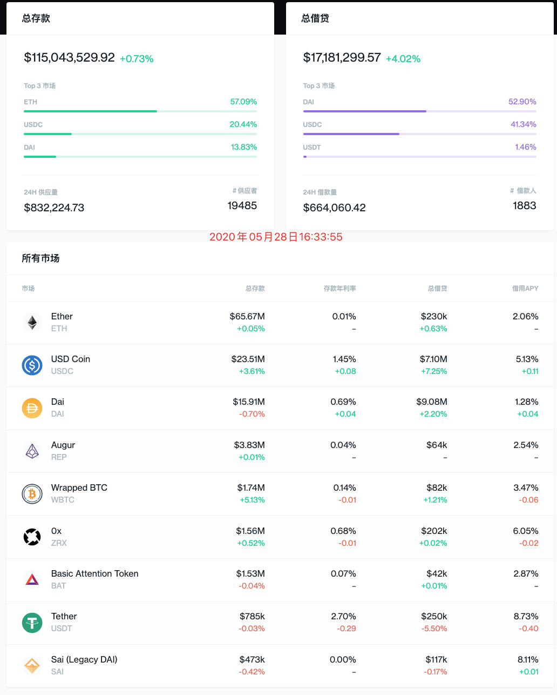

## 介绍

### 什么是 Compound
Compound 是一个允许用户借贷代币的智能合约，它与你的银行类似，Compound 把你的钱借给借款人，并随着时间的推移赚取利息。但与银行不同的是，你的利息是从你存入 Compound 的智能合约后开始复利计算的。因为这是一个智能合约，整个流程中没有中间人，因此利息会比传统银行要高。

与 MakerDAO 类似，Compound 的贷款是通过超额担保确立的。借贷者将代币存入 Compound 中以增加他们的 “借款能力”，如果借贷者的借款能力低于 0，他们的抵押品将被出售以偿还债务。另外，每个资产的贷款利率是不同的，这根据资产的需求而决定。

### Compound的运作机制
Compound 协议让开发者可以基于以太坊建立各种各样的货币市场（money market）。

所谓的「货币市场」，其实就是一个个的独立币池单元，每个币池里只有一种代币，协议通过算法来决定这个池子里的币借贷的利率是多少。简单点说，这个算法会基于人们对这个币借贷的供需关系自动计算出利率。

目前在 Compound 上开放的货币市场如下：

不管你是来贷款还是放贷，你都是在跟 Compound 协议直接打交道。这一点跟那些点对点的借贷协议不太一样。在点对点的方案里，借贷双方会做匹配，然后你需要跟找你借钱的人（或者借你钱的人）进行沟通，双方自己商定好借款的利率、到期时间和抵押物品等等。

而在 Compound 协议里，每个代币（比如 Ether、Dai、USDC）都有一个属于自己的借贷市场，里面包含每个用户在这个市场里的余额，以及各笔生效的借贷交易，乃至每段时期的历史利率，等等。

用户可以通过抵押品的信贷额度无缝地从协议上借钱，你只需要看自己要借哪个币，不需要和别人沟通还款日期、利率，就能马上借钱。借款是实时且可预测的。每个货币市场都有一个由市场决定的浮动利率。

### Compound 清算保证
和 MakerDAO 一样， Compound 为了保持系统稳定运行，也设置了一套完备的风险和清算规则。

Compound 协议强制应用了一条规则，即每个账户必须拥有足够的余额能够偿还借款的额度，叫做抵押率。每个账户无法做出任何会使「余额／借款额度」低于「抵押率」的行为。比如再借更多的钱或者把抵押款的余额提现。要增大或者重置抵押率，用户可以全额或者部分偿还借款。任何被 Compound 持有的余额，包括用户用来做抵押品的余额，同时也会产生正常的应计利息。

如果一个用户提供的抵押资产，除以他们信用额度所借的款项，低于抵押率，那他们的抵押资产就会（通过借款资产）被出售，出售的价格是当前市场价格减去清算折扣（liquidation discount）。这个机制会激励系统里的套利者，去快速减少借款人还不了的借款资产的短缺，从而降低协议的风险。