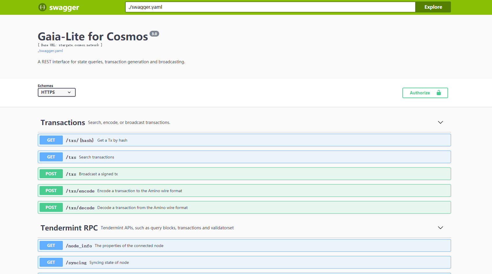
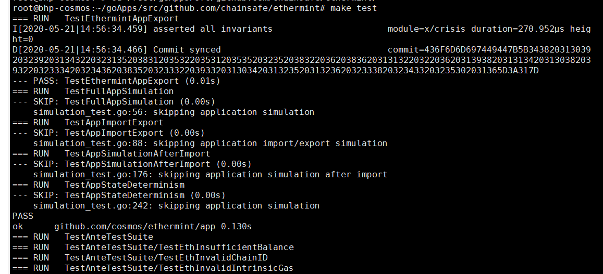

## 部署私有的Ethermint测试网
### 部署单节点
>前提
>
>安装[ethermint](install-ethermint.md)

启动节点可分为自动初始化和手动初始化
- 自动初始化

有两种方式，前台运行和后台运行程序，建议使用后者。运行程序默认使用端口为26657。

1. 进入`ethermint`目录，执行启动脚本（前台运行）
```
./init.sh
```
2. 后台运行并指定日志文件为init.log
```
nohup ./init.sh > init.log &
```
- 手动初始化

首先创建用于签署创始交易的密钥：(代码中的mykey替换成自己定义的字段,比如换成：bhptest2)
```
# 初始化genesis.json 文件
emintd init mymoniker --chain-id 8

# 客户端设置参数
emintcli config chain-id 8
emintcli config output json
emintcli config indent true
emintcli config trust-node true

emintcli config keyring-backend test

# 创建一个钱包作为您的验证人帐户，钱包名为node0(可以自定义设置)
emintcli keys add node0

# 将该钱包地址添加到genesis文件中的genesis.app_state.accounts数组中
# 注意: 此命令使您可以设置通证数量。确保此帐户有币，这是测试网络上唯一的质押通证
emintd add-genesis-account $(emintcli keys show node0 -a) 1000000000000000000photon,1000000000000000000stake

# 生成创建验证人的交易，gentx存储在~/.emintd/config/中
emintd gentx --name bhptest2 --keyring-backend test

# 将生成的质押交易添加到创世文件
emintd collect-gentxs

# 验证有效性
emintd validate-genesis

# 获取本节点node-id
emintd start --pruning=nothing
```

#### 启动Ethermint Web3 RPC API

重新打开一个终端，指定web3 rpc接口的ip和端口。

1. 开启另一个终端执行（可选择前台运行和后台运行）
```
emintcli rest-server --laddr "tcp://localhost:8545" --unlock-key mykey
nohup emintcli rest-server --laddr "tcp://localhost:8545" --unlock-key mykey > server.log &
```
2. 如果想要外网访问可执行（可选择前台运行和后台运行）
```
emintcli rest-server --laddr "tcp://0.0.0.0:8545" --unlock-key mykey
```
```
nohup emintcli rest-server --laddr "tcp://0.0.0.0:8545" --unlock-key mykey > server.log &
tail -f server.log
```
3. 可以通过以下命令测试RPC接口是否正常（另一个终端执行）
```
curl -X POST --data '{"jsonrpc":"2.0","method":"eth_blockNumber","params":[],"id":1}' -H "Content-Type: application/json" http://ip:8545
```
4. 访问ip:8545可以看到对应swagger-ui.html
 

#### 常用命令

[Ethermint常用命令使用指南](./emintcli-cmd.md )

#### 测试

1. 接口测试
```
make test
```
 

2. 客户端工具测试（暂无）
```
make test-cli
```
### 节点集群

[Ethermint部署多节点](./node-cluster-of-ethermint.md)

