Tenermint节点搭建按照系统可分为windows和linux方式。
## Windows方式搭建
### 工具和环境
- Windows10系统
- GIt Bash
### 搭建说明
本次搭建基于测试环境，在一台电脑上直接进行多个节点搭建；正式环境请使用多台服务器组合搭建。
### 搭建步骤
1. 进入发行版页面下载最新win版执行文件
[https://github.com/tendermint/tendermint/releases](https://github.com/tendermint/tendermint/releases)

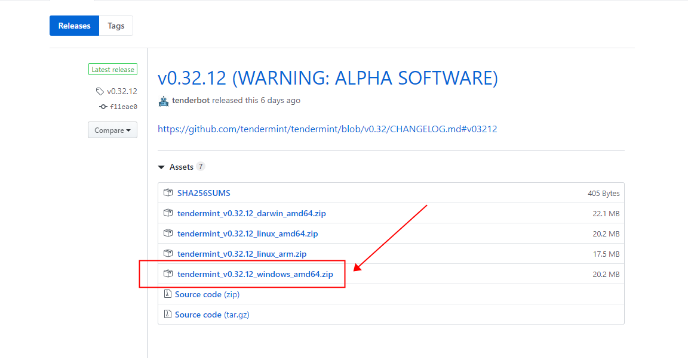

2. 本地新建四个文件夹，分别命名为0 1 2 3，把刚下载好的tendermint文件放入到目录0中。

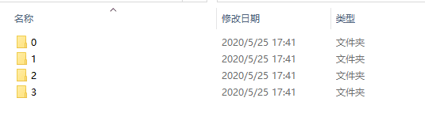

3. 在`目录0`文件夹中右键打开git bash，然后输入以下命令生成四个节点配置文件。（注意：win和linux的运行可执行文件生成的配置文件中的路径写法不一致，因此假如把win版的配置文件复制到linux使用要自行修改配置文件中的路径写法）
```
./tendermint testnet
```
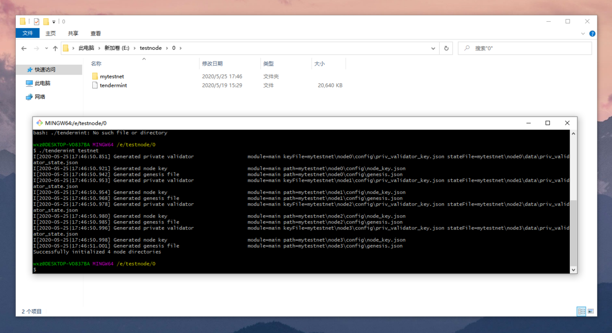

日志：
```
I[2020-05-25|17:46:50.851] Generated private validator                  module=main keyFile=mytestnet\node0\config\priv_validator_key.json stateFile=mytestnet\node0\data\priv_validator_state.json
I[2020-05-25|17:46:50.921] Generated node key                           module=main path=mytestnet\node0\config\node_key.json
I[2020-05-25|17:46:50.942] Generated genesis file                       module=main path=mytestnet\node0\config\genesis.json
I[2020-05-25|17:46:50.953] Generated private validator                  module=main keyFile=mytestnet\node1\config\priv_validator_key.json stateFile=mytestnet\node1\data\priv_validator_state.json
I[2020-05-25|17:46:50.954] Generated node key                           module=main path=mytestnet\node1\config\node_key.json
I[2020-05-25|17:46:50.968] Generated genesis file                       module=main path=mytestnet\node1\config\genesis.json
I[2020-05-25|17:46:50.978] Generated private validator                  module=main keyFile=mytestnet\node2\config\priv_validator_key.json stateFile=mytestnet\node2\data\priv_validator_state.json
I[2020-05-25|17:46:50.980] Generated node key                           module=main path=mytestnet\node2\config\node_key.json
I[2020-05-25|17:46:50.985] Generated genesis file                       module=main path=mytestnet\node2\config\genesis.json
I[2020-05-25|17:46:50.996] Generated private validator                  module=main keyFile=mytestnet\node3\config\priv_validator_key.json stateFile=mytestnet\node3\data\priv_validator_state.json
I[2020-05-25|17:46:50.998] Generated node key                           module=main path=mytestnet\node3\config\node_key.json
I[2020-05-25|17:46:51.001] Generated genesis file                       module=main path=mytestnet\node3\config\genesis.json
Successfully initialized 4 node directories
```
系统会自动生成mytestnet文件夹，包含node0、node1、node2、node3四个二级文件夹。

4、进入`node0`目录下的`config`目录，编辑`config.toml`文件


将文件中的端口2665X改为2660X，如下
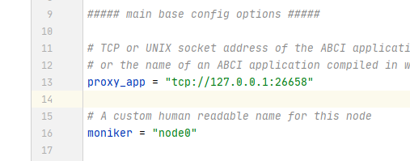

将文中的以下代码
```
proxy_app = "tcp://127.0.0.1:26658"
laddr = "tcp://127.0.0.1:26657"
laddr = "tcp://0.0.0.0:26656"
persistent_peers = "6e246ba5675a5036cc13a8e486693b5775d98fe8@node0:26656,adfcd468f111404b09cea838eb574e6bc52fc55f@node1:26656,0f059958939f99f813a2ebefcb5ff2d7a0798575@node2:26656,a822ecd614b8e225b8ca2404586f2bd9386711e7@node3:26656"
```
改为
```
proxy_app = "tcp://127.0.0.1:26608"
laddr = "tcp://127.0.0.1:26607"
laddr = "tcp://0.0.0.0:26606"
persistent_peers = "6e246ba5675a5036cc13a8e486693b5775d98fe8@node0:26606,adfcd468f111404b09cea838eb574e6bc52fc55f@node1:26616,0f059958939f99f813a2ebefcb5ff2d7a0798575@node2:26626,a822ecd614b8e225b8ca2404586f2bd9386711e7@node3:26636"
```
此时，node0目录已经改好，node1目录同理将2665X端口改为2661X，与修改node0的config.toml文件的方法相似，修改部分之后如下方代码所示。
```
proxy_app = "tcp://127.0.0.1:26618"
laddr = "tcp://127.0.0.1:26617"
laddr = "tcp://0.0.0.0:26616"
persistent_peers = "6e246ba5675a5036cc13a8e486693b5775d98fe8@node0:26606,adfcd468f111404b09cea838eb574e6bc52fc55f@node1:26616,0f059958939f99f813a2ebefcb5ff2d7a0798575@node2:26626,a822ecd614b8e225b8ca2404586f2bd9386711e7@node3:26636"
```
node2和node3同理，自行改之，不做过多介绍。

5. 将改好之后的mytestnet连同tendermint分别复制到其他1、2、3目录下，如下图所示
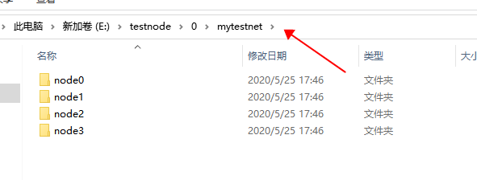
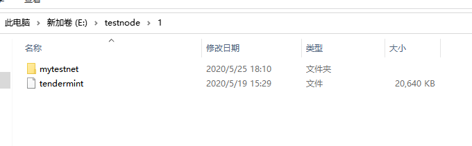

6. 在目录0中执行以下代码，获取四个节点ID。
```
./tendermint show_node_id --home ./mytestnet/node0
./tendermint show_node_id --home ./mytestnet/node1
./tendermint show_node_id --home ./mytestnet/node2
./tendermint show_node_id --home ./mytestnet/node3
```
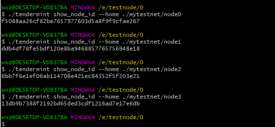

日志：
```
wxz@DESKTOP-VO837BA MINGW64 /e/testnode/0
$ ./tendermint show_node_id --home ./mytestnet/node0
f5088aa26cf82be7657977603d5a8f9f9cfae267

wxz@DESKTOP-VO837BA MINGW64 /e/testnode/0
$ ./tendermint show_node_id --home ./mytestnet/node1
ddb4df78fe5bdf120e8ba9468857765756948e18

wxz@DESKTOP-VO837BA MINGW64 /e/testnode/0
$ ./tendermint show_node_id --home ./mytestnet/node2
6bb7f6e1ef06ab114708e421ec84352f5f203e21

wxz@DESKTOP-VO837BA MINGW64 /e/testnode/0
$ ./tendermint show_node_id --home ./mytestnet/node3
13db9b7388f2192bd65ded3cdf1216ad7e17e6db
```

7. 启动四个节点

根据自己的每个节点id以及和对应ip编写启动命令，以下是启动命令如何配置的示例

拼接之前：
```
tendermint node --home ./mytestnet/node0 --proxy_app=kvstore --p2p.persistent_peers="ID1@IP1:26656,ID2@IP2:26656,ID3@IP3:26656,ID4@IP4:26656"
tendermint node --home ./mytestnet/node1 --proxy_app=kvstore --p2p.persistent_peers="ID1@IP1:26656,ID2@IP2:26656,ID3@IP3:26656,ID4@IP4:26656"
tendermint node --home ./mytestnet/node2 --proxy_app=kvstore --p2p.persistent_peers="ID1@IP1:26656,ID2@IP2:26656,ID3@IP3:26656,ID4@IP4:26656"
tendermint node --home ./mytestnet/node3 --proxy_app=kvstore --p2p.persistent_peers="ID1@IP1:26656,ID2@IP2:26656,ID3@IP3:26656,ID4@IP4:26656"
```
拼接之后：（在每个目录执行对应代码，目录0指定node0、目录1指定node1....，以下node_id和ip用自己的哦，不是文档中的哦）
```
./tendermint node --home ./mytestnet/node0 --proxy_app=kvstore --p2p.persistent_peers="f5088aa26cf82be7657977603d5a8f9f9cfae267@127.0.0.1:26606,ddb4df78fe5bdf120e8ba9468857765756948e18@127.0.0.1:26616,6bb7f6e1ef06ab114708e421ec84352f5f203e21@127.0.0.1:26626,13db9b7388f2192bd65ded3cdf1216ad7e17e6db@127.0.0.1:26636"

./tendermint node --home ./mytestnet/node1 --proxy_app=kvstore --p2p.persistent_peers="f5088aa26cf82be7657977603d5a8f9f9cfae267@127.0.0.1:26606,ddb4df78fe5bdf120e8ba9468857765756948e18@127.0.0.1:26616,6bb7f6e1ef06ab114708e421ec84352f5f203e21@127.0.0.1:26626,13db9b7388f2192bd65ded3cdf1216ad7e17e6db@127.0.0.1:26636"

./tendermint node --home ./mytestnet/node2 --proxy_app=kvstore --p2p.persistent_peers="f5088aa26cf82be7657977603d5a8f9f9cfae267@127.0.0.1:26606,ddb4df78fe5bdf120e8ba9468857765756948e18@127.0.0.1:26616,6bb7f6e1ef06ab114708e421ec84352f5f203e21@127.0.0.1:26626,13db9b7388f2192bd65ded3cdf1216ad7e17e6db@127.0.0.1:26636"

./tendermint node --home ./mytestnet/node3 --proxy_app=kvstore --p2p.persistent_peers="f5088aa26cf82be7657977603d5a8f9f9cfae267@127.0.0.1:26606,ddb4df78fe5bdf120e8ba9468857765756948e18@127.0.0.1:26616,6bb7f6e1ef06ab114708e421ec84352f5f203e21@127.0.0.1:26626,13db9b7388f2192bd65ded3cdf1216ad7e17e6db@127.0.0.1:26636"
```
8. 四个节点搭建成功，成功截图如下方动图所示

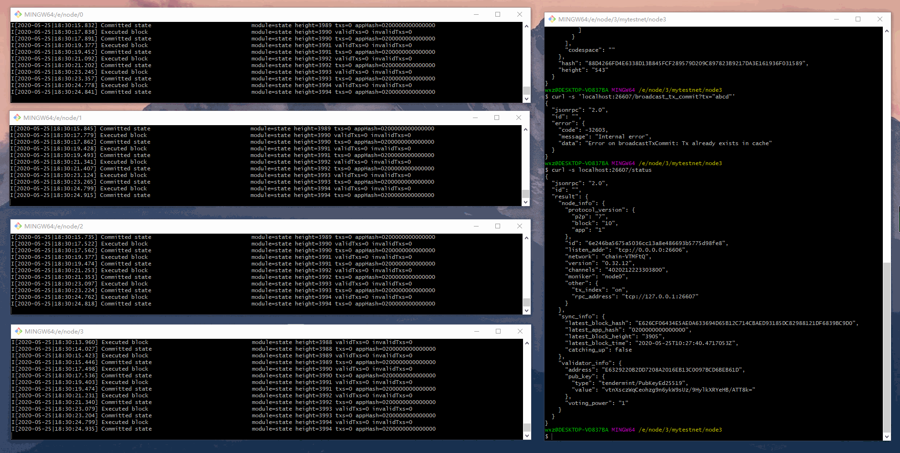

## Linux方式搭建
1. 在home目录新建`testnode`文件夹
```
mkdir testnode
```
2. 在testnode目录下新建四个文件夹，分别为000、001、002、003文件夹。
```shell script
mkdir 000
mkdir 001
mkdir 002
mkdir 003
```
3.  进入`000`目录下，执行以下命令生成四个节点配置文件
```
./tendermint testnet
```
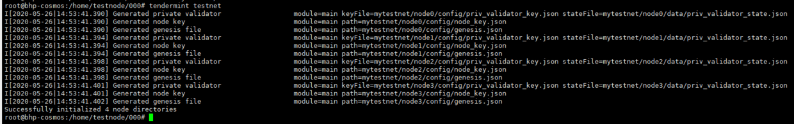

4. 进入`000`目录=>`mytestnet`目录=>`node0`目录=>`config`目录
```
cd mytestnet/node0/config
```
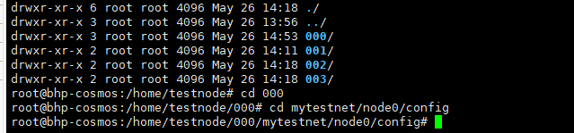

5. 编辑conf.toml文件，修改p2p端口号和rpc端口号

修改后，如下方代码所示(ip和node_id根据自己的设置)
```
proxy_app = "tcp://127.0.0.1:26618"
laddr = "tcp://0.0.0.0:26616"
laddr = "tcp://127.0.0.1:26617"
persistent_peers = "9f6594ced1cd8314c359b34bded2ac9880b60340@node0:26606,382f5658c2e47db72b2556d4ffb2cba22160dffc@node1:26616,b8316e5743c1ec7e0595b65cefec7a7c5748158b@node2:26626,b92e1328d91ab40e2de9bd7f5a1df58741aa0204@node3:26636"
```
依次修改001、002、003下的config.toml文件。

6.  在目录000中执行以下代码，获取四个节点ID。
```
tendermint show_node_id --home ./mytestnet/node0
tendermint show_node_id --home ./mytestnet/node1
tendermint show_node_id --home ./mytestnet/node2
tendermint show_node_id --home ./mytestnet/node3
```
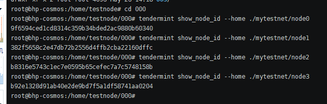

7. 将获取到的四个节点拼接

拼接之前：
```
tendermint node --home ./mytestnet/node0 --proxy_app=kvstore --p2p.persistent_peers="ID1@IP1:26656,ID2@IP2:26656,ID3@IP3:26656,ID4@IP4:26656"
tendermint node --home ./mytestnet/node1 --proxy_app=kvstore --p2p.persistent_peers="ID1@IP1:26656,ID2@IP2:26656,ID3@IP3:26656,ID4@IP4:26656"
tendermint node --home ./mytestnet/node2 --proxy_app=kvstore --p2p.persistent_peers="ID1@IP1:26656,ID2@IP2:26656,ID3@IP3:26656,ID4@IP4:26656"
tendermint node --home ./mytestnet/node3 --proxy_app=kvstore --p2p.persistent_peers="ID1@IP1:26656,ID2@IP2:26656,ID3@IP3:26656,ID4@IP4:26656"
```
拼接之后：（在每个目录执行对应代码，目录0指定node0、目录1指定node1....）
```shell script
nohup tendermint node --home ./mytestnet/node0 --proxy_app=kvstore --p2p.persistent_peers="9f6594ced1cd8314c359b34bded2ac9880b60340@47.103.38.41:26606,382f5658c2e47db72b2556d4ffb2cba22160dffc@47.103.38.41:26616,b8316e5743c1ec7e0595b65cefec7a7c5748158b@47.103.38.41:26626,b92e1328d91ab40e2de9bd7f5a1df58741aa0204@101.133.151.154:26636" > init000.log  &
tail -f init000.log

nohup tendermint node --home ./mytestnet/node1 --proxy_app=kvstore --p2p.persistent_peers="9f6594ced1cd8314c359b34bded2ac9880b60340@47.103.38.41:26606,382f5658c2e47db72b2556d4ffb2cba22160dffc@47.103.38.41:26616,b8316e5743c1ec7e0595b65cefec7a7c5748158b@47.103.38.41:26626,b92e1328d91ab40e2de9bd7f5a1df58741aa0204@101.133.151.154:26636" > init001.log  &
tail -f init001.log

nohup tendermint node --home ./mytestnet/node2 --proxy_app=kvstore --p2p.persistent_peers="9f6594ced1cd8314c359b34bded2ac9880b60340@47.103.38.41:26606,382f5658c2e47db72b2556d4ffb2cba22160dffc@47.103.38.41:26616,b8316e5743c1ec7e0595b65cefec7a7c5748158b@47.103.38.41:26626,b92e1328d91ab40e2de9bd7f5a1df58741aa0204@101.133.151.154:26636" > init002.log  &
tail -f init002.log

nohup ./tendermint node --home ./mytestnet/node3 --proxy_app=kvstore --p2p.persistent_peers="9f6594ced1cd8314c359b34bded2ac9880b60340@47.103.38.41:26606,382f5658c2e47db72b2556d4ffb2cba22160dffc@47.103.38.41:26616,b8316e5743c1ec7e0595b65cefec7a7c5748158b@47.103.38.41:26626,b92e1328d91ab40e2de9bd7f5a1df58741aa0204@101.133.151.154:26636" > init003.log  &
tail -f init003.log

##
nohup ./tendermint node --home ./mytestnet/node0 --proxy_app=kvstore --p2p.persistent_peers="b04fc02bc23a0c660a5e4264a9f51894577db166@47.103.38.41:26606,dc359124afc062357c85a755128d54e6f3eecefa@47.103.38.41:26616,c9f3b7f5e46bf4cc62dc04f0020a702a11bf8d6b@47.103.38.41:26626,3705dde1f6eefc5fb647ff748023645d53852e5f@101.133.151.154:26636" > init000.log  &
tail -f init000.log

nohup ./tendermint node --home ./mytestnet/node1 --proxy_app=kvstore --p2p.persistent_peers="b04fc02bc23a0c660a5e4264a9f51894577db166@47.103.38.41:26606,dc359124afc062357c85a755128d54e6f3eecefa@47.103.38.41:26616,c9f3b7f5e46bf4cc62dc04f0020a702a11bf8d6b@47.103.38.41:26626,3705dde1f6eefc5fb647ff748023645d53852e5f@101.133.151.154:26636" > init000.log  &
tail -f init000.log

nohup ./tendermint node --home ./mytestnet/node2 --proxy_app=kvstore --p2p.persistent_peers="b04fc02bc23a0c660a5e4264a9f51894577db166@47.103.38.41:26606,dc359124afc062357c85a755128d54e6f3eecefa@47.103.38.41:26616,c9f3b7f5e46bf4cc62dc04f0020a702a11bf8d6b@47.103.38.41:26626,3705dde1f6eefc5fb647ff748023645d53852e5f@101.133.151.154:26636" > init000.log  &
tail -f init000.log

nohup ./tendermint node --home ./mytestnet/node3 --proxy_app=kvstore --p2p.persistent_peers="b04fc02bc23a0c660a5e4264a9f51894577db166@47.103.38.41:26606,dc359124afc062357c85a755128d54e6f3eecefa@47.103.38.41:26616,c9f3b7f5e46bf4cc62dc04f0020a702a11bf8d6b@47.103.38.41:26626,3705dde1f6eefc5fb647ff748023645d53852e5f@101.133.151.154:26636" > init000.log  &
tail -f init000.log

##
/tendermint node --home ./mytestnet/node3 --proxy_app=kvstore --p2p.persistent_peers="b04fc02bc23a0c660a5e4264a9f51894577db166@47.103.38.41:26606,dc359124afc062357c85a755128d54e6f3eecefa@47.103.38.41:26616,c9f3b7f5e46bf4cc62dc04f0020a702a11bf8d6b@47.103.38.41:26626,3705dde1f6eefc5fb647ff748023645d53852e5f@101.133.151.154:26636"

nohup ./tendermint node --home ./mytestnet/node4 --proxy_app=kvstore --p2p.persistent_peers="a106df71de7c413311cf2394354b5b5f4e177f09@101.133.151.154:26646,3705dde1f6eefc5fb647ff748023645d53852e5f@101.133.151.154:26636" > init004.log  &

```
8. 四个节点搭建成功，成功截图如下方动图所示

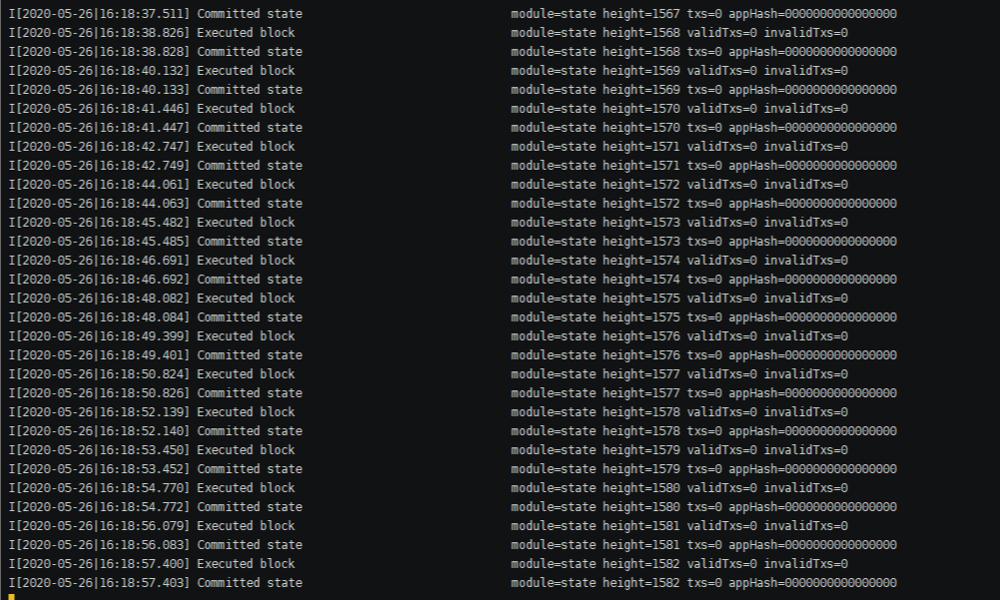

###节点加入
节点加入分为非验证节点和验证节点(本示例用linux系统作为演示)
- 非验证节点接入

复制原始的 `genesis.json` 到 `~/.tendermint/config`
```shell script
{
  "genesis_time": "2020-05-26T06:53:41.402083295Z",
  "chain_id": "chain-waOdSM",
  "consensus_params": {
    "block": {
      "max_bytes": "22020096",
      "max_gas": "-1",
      "time_iota_ms": "1000"
    },
    "evidence": {
      "max_age_num_blocks": "100000",
      "max_age_duration": "172800000000000",
      "max_num": 50
    },
    "validator": {
      "pub_key_types": [
        "ed25519"
      ]
    }
  },
  "validators": [
    {
      "address": "2B61F3C570D421F2E5151C920A8B70D0FC38285C",
      "pub_key": {
        "type": "tendermint/PubKeyEd25519",
        "value": "8lIohmxa7nxdh3F6sJxsuP92ZvjX2EDQk4aKMdc/Dn8="
      },
      "power": "1",
      "name": "node0"
    },
    {
      "address": "0E9D395C3FD0A91B25770A5D97E4AAEDB2224473",
      "pub_key": {
        "type": "tendermint/PubKeyEd25519",
        "value": "GOnMZkSBMT0RAvSpV6fJTK6KRqzitSgfU05mauvZCYM="
      },
      "power": "1",
      "name": "node1"
    },
    {
      "address": "811812654A1C7337B7E9175C4C00DF8A3E782E1F",
      "pub_key": {
        "type": "tendermint/PubKeyEd25519",
        "value": "9wfTIEgM8DkMG3YOcK63jmPrER/jxDjsoy5I1UVD/T0="
      },
      "power": "1",
      "name": "node2"
    },
    {
      "address": "152F1F413D3216D6DC44C1EBE1294EEA57F97304",
      "pub_key": {
        "type": "tendermint/PubKeyEd25519",
        "value": "Rl0VDn4Ty8HOQ8EYRVhpmMuwIjkdCJ/FSxZAVU60iYw="
      },
      "power": "1",
      "name": "node3"
    }
  ],
  "app_hash": ""
}
```
连接节点
```
./tendermint show_node_id
./tendermint node --proxy_app=kvstore --p2p.persistent_peers "5ec4a4097bcac694b36281db831b33a26c9f7727@101.133.151.154:26656,b92e1328d91ab40e2de9bd7f5a1df58741aa0204@47.103.38.41:26636"
```

curl '47.103.38.41:26637/dial_seeds?seeds=\["5ec4a4097bcac694b36281db831b33a26c9f7727@101.133.151.154:26646","b92e1328d91ab40e2de9bd7f5a1df58741aa0204@47.103.38.41:26636"\]'

## 常见问题
- 读取失败，可能是tendermint版本不一致的问题
- 提示以下错误，可能是之前其他节点的残留端口未关闭比如26657/26658/26656
```shell script
 auth failure: conn.ID (382f5658c2e47db72b2556d4ffb2cba22160dffc) dialed ID (dc359124afc062357c85a755128d54e6f3eecefa) mismatch module=pex addr=dc359124afc062357c85a755128d54e6f3eecefa@47.103.38.41:26616
```


## 参考文档
[https://docs.tendermint.com/master/introduction/quick-start.html](https://docs.tendermint.com/master/introduction/quick-start.html)


