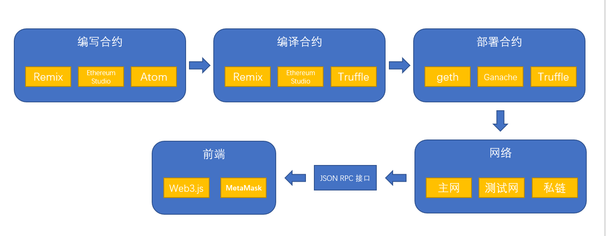

## 智能合约

1.IDE开发环境

- 开发，编译，部署

Remix IDE 地址：https://remix.ethereum.org/

- 开发，编译，部署，前端调用

Ethereum Studio 地址：https://studio.ethereum.org/

- 客户端工具

其它开发环境：https://github.com/ConsenSys/ethereum-developer-tools-list#ides

ATOM 地址： https://atom.io/

- 客户端工具，需要安装插件

Visual Studio Code 地址：https://marketplace.visualstudio.com/items?itemName=JuanBlanco.solidity

2.开发者工具

Truffle 地址：https://truffleframework.com/

部署，测试链，账户钱包

其它开发工具：https://github.com/ConsenSys/ethereum-developer-tools-list#frameworks

3.前端

web3.js 中文文档：https://web3.tryblockchain.org/Web3.js-api-refrence.html
web3.js 英文文档：https://web3js.readthedocs.io/en/v1.2.3/

4.库

OpenZeppelin 地址：https://openzeppelin.org/

5.账户钱包

- 浏览器插件

Metamask 地址：https://metamask.io/

- 客户端全节点钱包，包含浏览器

MIST 地址：https://github.com/ethereum/mist/releases

- 生成本地钱包

Truffle 地址：https://truffleframework.com/

- 搭建节点后生成钱包

geth 地址：https://github.com/ethereum/go-ethereum

- 生成本地钱包，图形化界面

Ganache 地址：https://www.trufflesuite.com/ganache

6.部署工具

- 编译和部署智能合约，命令行界面

Truffle 地址：https://truffleframework.com/

- 编译和部署智能合约，浏览器界面

Remix 地址：https://studio.ethereum.org/

7.测试链

- 生成模拟测试链

Truffle 地址：https://truffleframework.com/

- 生成模拟测试了，图形化界面

Ganache 地址：https://www.trufflesuite.com/ganache

- 通过搭建节点实现连接真正的测试链

geth 地址：https://github.com/ethereum/go-ethereum

8.网络

主网
Ropsten 水管地址：https://faucet.ropsten.be/
Rinkeby 水管地址：https://faucet.rinkeby.io/
私链

9.浏览器

https://etherscan.io/
https://www.etherchain.org/

10.节点搭建

- 搭建主链，测试链，私链

geth 地址：https://github.com/ethereum/go-ethereum

- geth的命令参数文档

geth 文档地址：https://learnblockchain.cn/2017/11/29/geth_cmd_options/

更多资源：https://github.com/ConsenSys/ethereum-developer-tools-list#ethereum-clients